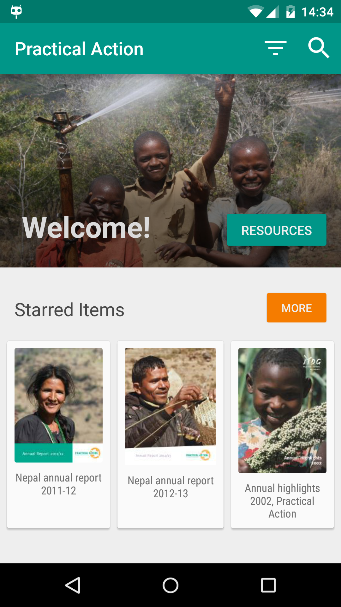
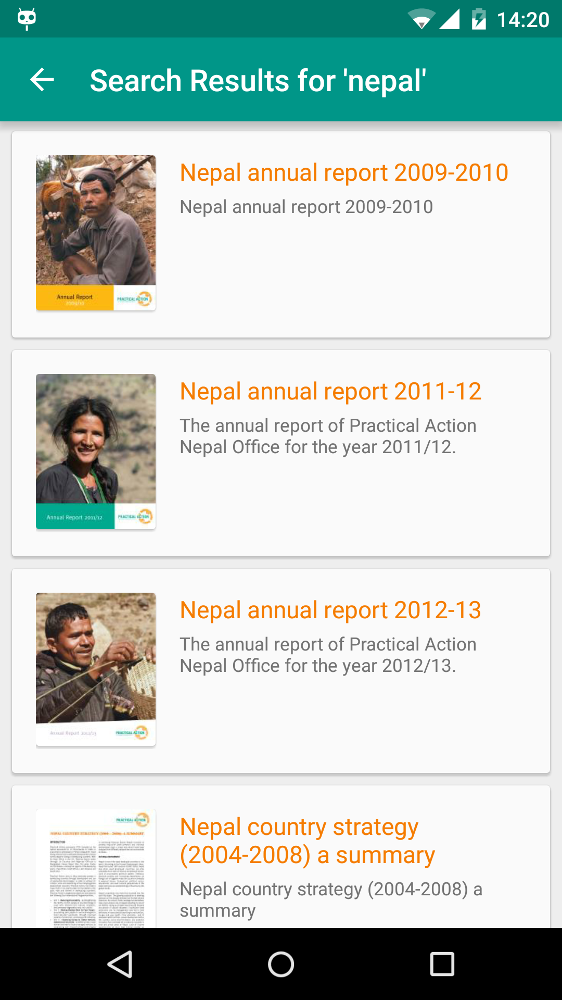
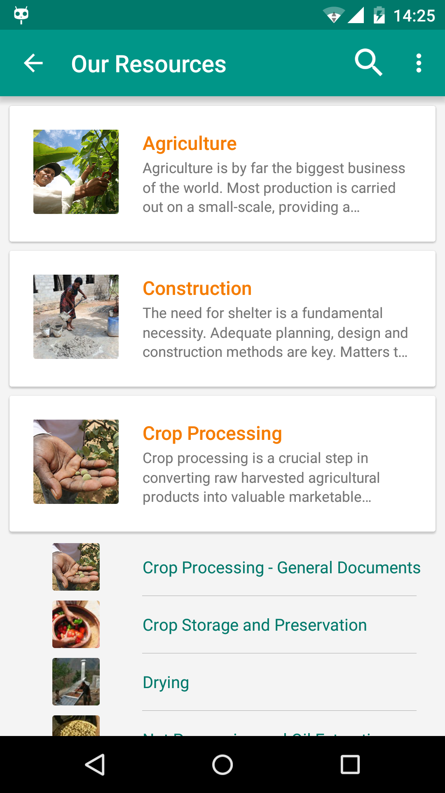
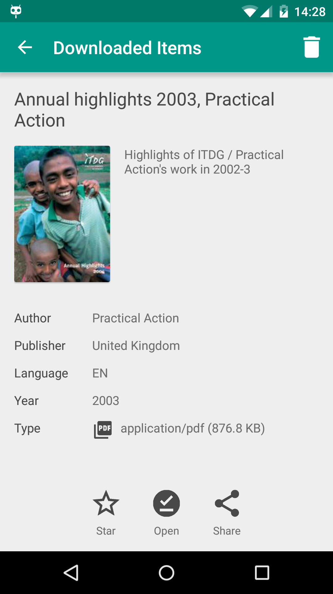
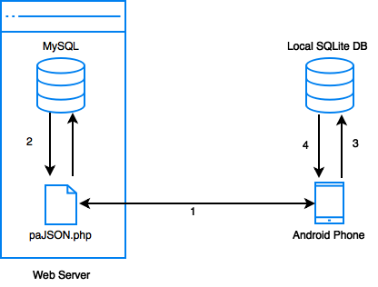

# Practical Answers - Document Browser Android 
Created by **Smart Solutions**, 2015.

## Functionality and Usage

### Home Screen

Upon opening the application, the home screen will be displayed, along with a welcome message. This screen can be accessed from any other screen by tapping on the `Home` button in the menu on the top right.

#### Starred and Downloaded Items

The home screen will also display at most three recently starred and three recently downloaded documents, if there are any. If there are more than three starred or downloaded documents, the complete list of the documents can be accessed by tapping the `MORE` button which will appear next to the section heading.

#### Language Filter

Tapping the language filter button on the top ActionBar will bring up the language filter settings dialog.  Only documents written in the selected language will be shown throughout the app. This setting will remain set even when the app is restarted. 

#### Search

You may search for a document by tapping on the search icon in the top ActionBar. Searching for a document matches the search query against the titles and descriptions, and the results are ordered by relevance.

If the device is connected to the internet, the app will search all items in the web server. If the device is not connected to the internet, only the documents which have been loaded in the local SQLite database on the device will be searched, and an `Offline Search` message will be shown.

### Our Resources Screen

Tapping on the `Resources` button on the home screen will open the Our Resources screen, which will display a list of document categories along with its descriptions. These categories are sorted in alphabetical order. 

When a category is tapped, a list of sub-categories will be displayed if there are any. Tapping on a sub-category will display a list of all the documents within that sub-category.

### Document Screen

The document screen will show detailed information about the selected document, including:
* Title
* Thumbnail 
* Description
* Author
* Publisher
* Language
* Year Published
* Type and Size

Tapping on the `Star` button will add the document to the collection of starred documents, accessible from the home screen.

Tapping on the document thumbnail or the `Download` button will download the document to the external storage (SDCard) of the device. All downloaded documents are stored in a folder named `PracticalAction` in the root of the external storage directory. A downloaded document may be deleted from the device by clicking the trash icon on the top right.

A document that has not been downloaded can be previewed by tapping on the `Web Preview` button in the top right menu.

#### Viewing a Downloaded Document

Downloaded documents may be viewed by tapping the `Open` button, which will open the document in the PDF viewer embedded into the application. The PDF can be opened with an external app by tapping the `Open in...` button in the top right menu when viewing a document.

*__Note:__ Uninstalling or re-installing the application will clear the `Starred` and `Downloaded` lists, but will not delete the downloaded documents itself from external storage.*

## Obtaining Data

### Server Side

All server side queries take place in the `paJSON.php` file. The application receives its data by querying to the server via the HTTP GET method. The data is then returned by the PHP script in JSON format.

### Client Side

The data received by the app is stored in a SQLite database on the Android phone itself to make it available offline. The data is replaced when refreshed. 

### Order of Execution

1. The Android application requests data from the server through `HTTP GET` to the PHP script. An initial request is made for the list of categories when the *Our Resources* page of the app is loaded. Further requests are made to get the list of documents when a category is selected.

2. The `paJSON.php` file queries the MySQL Database and returns the encoded data in JSON format.

3. The app parses the JSON encoded data and stores it locally in a SQLite Database.

4. The updated content is displayed on the screen. 

5. When not connected to the internet, the app pulls data locally from the SQLite Database instead of sending a request to the server.

Created on *Android Studio, v1.3*. Tested on Android *Lollipop* and *KitKat*.
##### Last Edit: July 28, 2015
